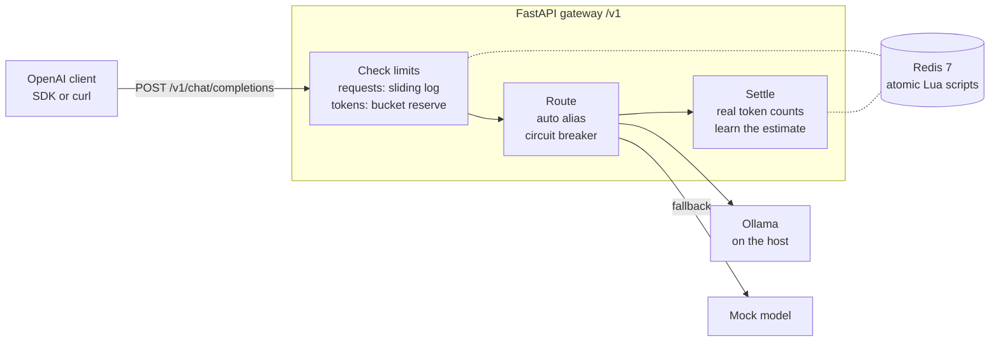
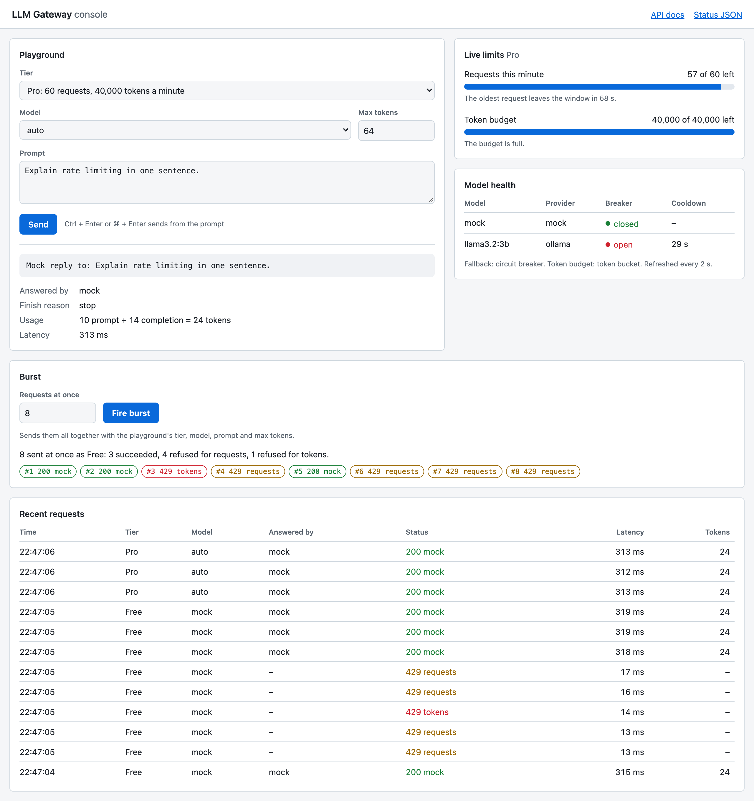

# LLM Gateway

[](https://github.com/DarshanPotnis/llm-gateway/actions/workflows/ci.yml)

Stops any single user from overloading or overspending an AI model: the same kind of request and token limits OpenAI enforces on its own API, built from scratch.

An OpenAI-compatible gateway in FastAPI that enforces per-tier request and token budgets atomically in Redis, routes to a local Ollama model with circuit-breaker fallback, and settles every request against the model's real token counts.


## How it works



Each request is sized, checked against its tier's requests per minute, and its tokens are
reserved before the model is called. Afterwards the reservation is settled against what the
model actually used. Every limit is a single Lua script, so concurrent requests cannot slip
past a limit together.

## Results

Each optimized piece replaced a simple first version, measured by the tests:

| Outcome | Before | After |
|---------|-------:|------:|
| Tokens let through by a burst right as the limit resets (limit 100) | 200 | 110 |
| Estimated cost of a real 32-token prompt, after learning | 7 | 32 |
| Tokens reserved for a 26-token request after a 20-message chat | 121 | 26 |
| Wait on the 4th request while the model is hung | 311 ms | 11 ms |

Full timings and the command that reproduces them: [docs/results.md](docs/results.md).

The console at `http://localhost:8000` shows the same limits live: send requests as any
tier, fire a burst, watch the token bucket refill, and see a model's circuit breaker open.



## Quickstart

```bash
git clone https://github.com/DarshanPotnis/llm-gateway.git
cd llm-gateway
docker compose up -d --wait        # Redis and the gateway; open http://localhost:8000 for the console
```

```python
from openai import OpenAI

client = OpenAI(base_url="http://localhost:8000/v1", api_key="free-tier-key")
reply = client.chat.completions.create(model="mock", messages=[{"role": "user", "content": "Hello"}])
print(reply.choices[0].message.content)  # Mock reply to: Hello
```

For the whole tour, run `pip install openai && python scripts/demo.py`. It needs no Ollama;
to serve a real model, see [docs/development.md](docs/development.md#ollama-optional).

## Engineering decisions

**Lua instead of MULTI.** A limiter must check and then write: record this request only if
the caller is under the limit. `MULTI` only queues commands, so it cannot branch on a count
read in the same transaction. Each limit is therefore one Lua script, which Redis runs
atomically. The original check-then-write code admitted 20 of 20 concurrent requests against
a limit of 5; the script admits exactly 5.

**The Redis clock.** Windows, refills and resets use Redis `TIME`, not each app server's
clock, so every gateway process agrees. This mattered even in tests: Redis ran in a Docker VM
whose clock was 76 ms ahead of the Mac's, and a test comparing the two clocks failed about
one run in eight until it read Redis time on both sides.

**Reserve, then settle.** A request's cost is unknown until the model answers, so the gateway
reserves an estimate (prompt plus maximum reply) before the call and settles against the
model's real counts after: unused tokens are refunded, overruns are charged, and a token
bucket can go briefly into debt that its refill pays back. A request that could never fit is
refused with a 400 before it uses any quota.

**A shielded release, and a test that first proved nothing.** If the model fails or the
client disconnects, the reservation is released in a `finally` block shielded from
cancellation. The first test for this passed even with the shield removed: the Redis client
had already written the release to its socket before the cancellation landed. The test now
closes the gateway's idle Redis connections first, so the release has to reconnect, and
without the shield it fails.

**`x-should-retry`.** OpenAI's SDKs retry 5xx responses twice. For a model that timed out
after 120 seconds that means up to six minutes; for an open circuit breaker, a retry into the
same 503. The SDK's source showed it honours a non-standard `x-should-retry: false` header
before its retry-every-5xx rule, and a test proves it: with the header the SDK sends one
request, without it three.

**Breaker state per process.** Rate limits and token budgets are fairness guarantees, so
they live in Redis and hold across processes. Circuit-breaker state only saves time: losing
it on a restart costs a few failed attempts, each process pays at most three failures per
cooldown, and routing never waits on Redis, so the breaker keeps working when Redis does not.

## Known limitations

- A full token bucket still allows one minute's budget as a single burst.
- Only the chat template's overhead is learned; message text is still estimated as
  characters ÷ 4, so code or non-English prompts can be under-reserved (settlement then
  charges the difference).
- With the model hung, one trial request per breaker cooldown still waits the full read
  timeout.
- A request refused for tokens still counts against requests per minute.
- API keys and tiers are hard-coded demo values, and replies are not streamed.

## Roadmap

- **Response caching:** serve repeated prompts from Redis without calling the model.
- **Streaming:** OpenAI-style server-sent events, settling the reservation when the stream ends.

## Documentation

- [API reference](docs/api.md): endpoints, headers, every error code, the console and `/status`
- [Configuration](docs/configuration.md): all settings, tiers and keys
- [Development](docs/development.md): running without Docker, Ollama, tests, recording the demo
- [Results](docs/results.md): full timings and how to reproduce them

Built by Darshan Potnis.
